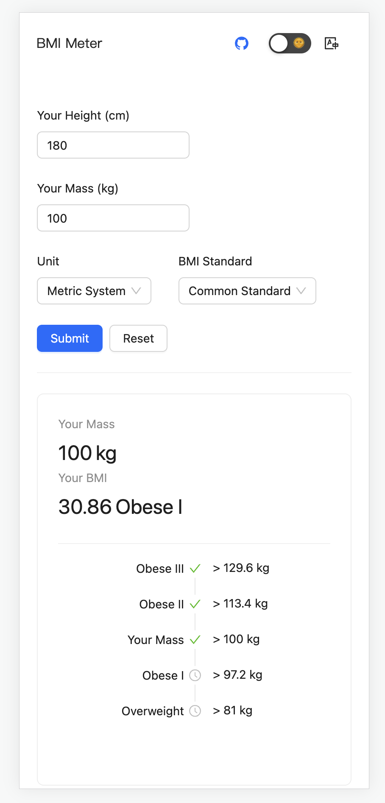

# bmi-meter

Yet another BMI calcultor

[Demo](https://bmi-meter.web.app/)

### :star2: Features

- Shows a full tree of weights corresponding to all levels of BMIs
- Supports both Metric and Imperial units
- Supports different BMI standards
- Supports EN/FR/JA/CHS languages
- PWA ready

### :framed_picture: Gallery

### :information_source: References

- [Body mass index](https://en.wikipedia.org/wiki/Body_mass_index)
